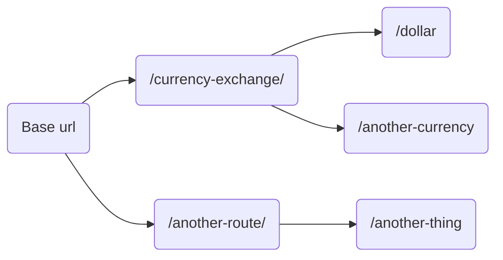

# API Mix!

> git clone 
> npm i

## Folder structure

The following UML will try to explain the folder structure.

```mermaid
graph LR

A[/src]  --> C[/application]
C --> D[/routes]
C --> G[/controllers]

D -- groups all routes--> F(index.js)
D --> H(some-route.route.js)
A --> E(server.js) 

G --> K(some-controller.controller.js)

```
Endpoints are composed like:

